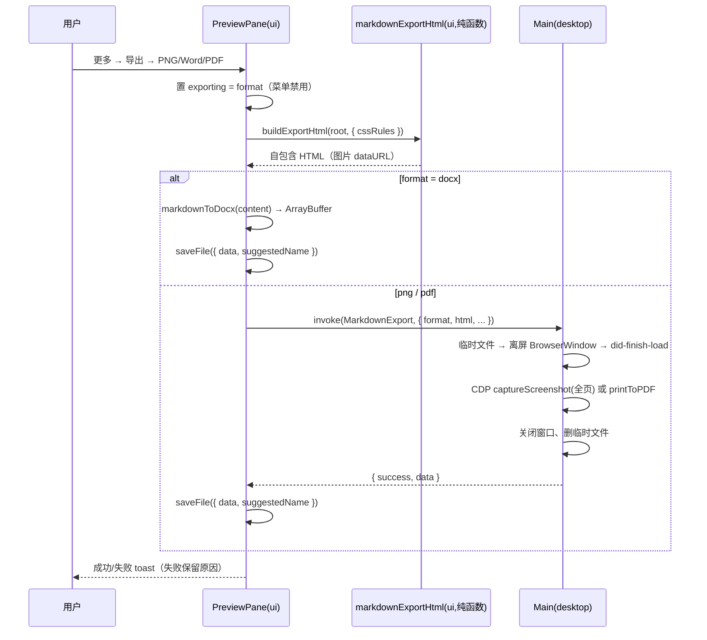

# Markdown 导出（Word / PDF / 图片）方案 v2

> 状态：**已定稿（决策固化，实现中）**。日期：2026-09-24。v1 → v2 变化：接口收敛（docx 走渲染层，主进程只保留一个离屏渲染通道）、三个决策点全部定案（见第六节）。

## 一、背景与范围决策

复刻 NewMax Markdown 预览组件时，范围收敛为**导出三件套**：把当前预览的 Markdown 文件导出为 **PNG 长图 / Word（.docx）/ PDF**。

| NewMax 原有 | 是否复刻 | 原因 |
| --- | --- | --- |
| 富文本编辑、源码编辑视图 | 不做（预览/代码双态沿用现有） | 引入 Tiptap 是新依赖，风险高于收益 |
| AI 改写 | 不做 | 超出本范围 |
| 卡片预览、AI 版式 | 不做 | 自研量大，无出口 |
| 公众号/X 发布 | 不做 | 页面自动化 brittle，维护责任重 |
| 复制微信格式、隐藏图片说明、公众号预览视图 | 不做 | 「公众号预览」的唯一出口是发布与复制，二者皆砍则该视图为死视图 |
| **导出 PNG / HTML / Word** | **做**（PDF 为本方案新增） | 本方案主题 |

与 NewMax 的差异：NewMax 导出为 **PNG 长图、HTML、Word** 三件，**没有 PDF**。PDF 是本方案新增诉求，依托 Electron 主进程 `printToPDF`（现有 `desktopPrintToPdf.ts` 已验证可用）。HTML 导出本方案不做（浏览器可直接看，价值低）。

## 二、现状基线（已核实）

| 能力 | 现状 | 位置 |
| --- | --- | --- |
| Markdown 渲染栈 | `marked 16.4.2`、`katex ^0.16.45`、`shiki ^4.0.2`、`@streamdown/mermaid` 已在 `packages/ui` 依赖 | packages/ui/package.json |
| 文件预览面板 + Markdown 预览态 | `previewPaneContent.tsx` 已有 `MarkdownPreviewContent`（渲染 `<MessageResponse>`，KaTeX/Mermaid/shiki 均在其中） | packages/ui/src/previewPaneMarkdownContent.tsx |
| 打印 PDF | `PlatformChannels.PrintToPdf` 已注册，preload 已暴露，`preferCSSPageSize` 模式 | packages/desktop/src/main/desktopPrintToPdf.ts |
| 全页截图 | CDP `Page.captureScreenshot` 已有成熟用法（且规避了 renderer `capturePage` 的 V8 FATAL） | packages/desktop/src/main/browserView/browserCommandPageHandlers.ts |
| 保存文件对话框 + buffer 落盘 | `PlatformChannels.SaveFile` 已注册，preload 已暴露（`saveFile(SaveFileRequest)`） | packages/desktop/src/main/desktopSaveFile.ts |
| docx 生成库 | `@extend-ai/react-docx` 已在 `packages/ui` 依赖（预览侧在用，生成侧本次接通） | packages/ui/package.json |
| 字体资产 | 仓库内**无**打包字体（woff2/ttf 零命中） | — |

## 三、产品规则

### 3.1 三种导出的行为

| 格式 | 行为规则 |
| --- | --- |
| **PNG 长图** | 单张 PNG，宽度 = 预览正文宽度；**固定浅色白底**（见 6.3）；正文过长（超过阈值 12000 CSS px）时提前提示「不建议导出」但不阻止；公式按已渲染的 KaTeX DOM 输出 |
| **Word（.docx）** | **固定浅色白底**；标题/列表/表格/图片/代码块保结构化；公式与代码块按纯文本降级保留（Word 对复杂 CSS 支持有限，接受降级）；本地图片内联进文档 |
| **PDF** | 页面尺寸由导出 HTML 的 `@page` CSS 决定（复用 `preferCSSPageSize`）；固定浅色；分页由 Chromium 打印管线负责 |

### 3.2 通用规则

1. **DOM 快照导出**：HTML 直接用预览区已渲染的 DOM（`data-markdown-preview` 容器的 innerHTML）+ 运行时样式表快照（KaTeX/shiki 所需 CSS 规则）拼装，**不重新解析 markdown**——保证导出与预览像素级一致，公式/Mermaid/高亮零二次实现。
2. **本地图片内联**：导出前把 markdown 渲染产物中的本地图片（file:// / local-file://）转成 dataURL；缺图则报错并中止，不产出残缺文件。
3. **导出互斥**：同一文件同时只允许一个导出任务进行中；进行中菜单项禁用。
4. **失败语义**：任何一步失败（渲染、转换、落盘）都向用户显示明确原因，**不伪造成功**；不留下半成品文件。
5. **目录与命名**：默认文件名取文件标题（去扩展名），保存对话框可改。
6. **入口**：预览工具栏「更多」菜单内「导出」子菜单，选择 PNG / Word / PDF。

## 四、架构与状态所有者

- **Renderer（packages/ui）**：
  - `lib/markdownExportHtml.ts`（domain 纯函数）：预览 DOM + 样式表快照 → 自包含 HTML 字符串。唯一 HTML 构建者。
  - `lib/markdownToDocx.ts`（domain 纯函数）：markdown AST（`marked.lexer`）→ docx 文档块，由 react-docx 打包成 ArrayBuffer。docx 不经 IPC。
  - `PreviewPane.tsx`：工具栏导出子菜单与互斥状态（`exporting: 'png' | 'docx' | 'pdf' | null`，UI 局部状态，单 owner）。
- **Main（packages/desktop）**：`desktopMarkdownExport.ts`——只做窗口与原生操作：临时 HTML 落盘 → 离屏 BrowserWindow 加载 → CDP `Page.captureScreenshot`（PNG）/ `printToPDF`（PDF）→ 返回 buffer → 清理。**不做 markdown 解析，不持有业务状态**；按 `event.sender.id` 串行化防并发（参照 `desktopPrintToPdf.ts`）。
- **Shared**：`platform.ts` 类型 + `channels.ts` 通道 `MarkdownExport`（严格类型）。
- **落盘**：全部格式统一走已有 `saveFile(SaveFileRequest)`（data: ArrayBuffer + suggestedName），不新增保存通道。

## 五、接口定义（定稿）

```ts
// packages/shared/src/platform.ts
export interface MarkdownExportRequest {
  format: "png" | "pdf";
  /** 自包含 HTML（图片已内联为 dataURL） */
  html: string;
  /** PNG 专用：宽度（CSS px），默认 760 */
  width?: number;
  /** PNG 专用：像素密度，默认 2 */
  scale?: number;
  /** PNG 专用：内容高度（CSS px），用于配置 captureBeyondViewport 的完整捕获 */
  contentHeight?: number;
}
export interface MarkdownExportResult {
  success: boolean;
  /** 成功时的字节 */
  data?: ArrayBuffer;
  /** "busy" | "render_failed" | "load_failed" */
  error?: string;
}
```

```ts
// channels.ts
MarkdownExport: "zcode:markdown-export"  // request: MarkdownExportRequest, response: MarkdownExportResult
```

preload：`exportMarkdownPage(payload: MarkdownExportRequest): Promise<MarkdownExportResult>`。

docx 路径（不经 IPC）：renderer `markdownToDocx.ts` 生成 `ArrayBuffer` → 直接调 `saveFile({ data, suggestedName })`。

### 事件顺序



## 六、技术路线与决策结论

### 6.1 PNG 长图：CDP 全页截图

离屏窗口加载导出 HTML 后走 `Page.captureScreenshot`（`captureBeyondViewport: true`）。依据：`browserCommandPageHandlers.ts` 已在用该路线并注释说明 renderer `capturePage` 会触发 V8 FATAL，长页场景必须走 CDP。PNG 宽度/高度由 HTML 内 `@page`/body 宽度与 `contentHeight` 控制。

### 6.2 PDF：离屏窗口 + printToPDF

复用 `desktopPrintToPdf.ts` 参数经验：`printBackground: true`、`preferCSSPageSize: true`、零 margins。与现有通道的区别：现有通道打印**当前窗口**，本方案打印**离屏加载的导出 HTML**，因此新开通道。

### 6.3 Word docx：引入官方 `docx` 库，渲染层生成（已定稿，含 v2.1 修正）

**v2.1 修正**：核实后发现仓库里的 `@extend-ai/react-docx` / `docx-preview` 都是 **docx 查看器**（渲染 docx 预览），不具备生成能力；workspace 亦无 `docx` 生成库。因此路线 B 修正为：**引入官方 `docx` 生成库（npm `docx`，Packer.toBlob）到 `packages/ui` 依赖**，`markdownToDocx.ts` 用 `marked.lexer` 解析 markdown，映射 heading / paragraph / list / table / image / code / blockquote 为 docx 文档块，renderer 侧打包为 ArrayBuffer 后走已有 `saveFile`。新依赖经 `pnpm architecture:check` 与 typecheck 验证；复杂 CSS/KaTeX 公式降级为纯文本（验收基准：结构保留、公式可读）。

### 6.4 字体：系统字体栈（已定案）

**定案 C**：导出 HTML 声明中文字体栈（如 `"PingFang SC", "Microsoft YaHei", "Noto Sans SC", sans-serif`），不打包字体。与 NewMax「加载字体 CSS」的行为对齐但不带体积代价。

### 6.5 主题：固定浅色（已定案）

三种导出统一固定浅色白底，不做「跟随主题的 PNG」。减少 UI 复杂度，Word/PDF 本就是浅色优先场景。

## 七、验收场景

1. **PNG**：含本地图片 + `$$` 公式 + 代码块 + 表格的 Markdown → 预览态点导出 PNG → 图片与公式正确渲染、长图无截断、白底。
2. **PDF**：同一文档 → 导出 PDF，`@page` 尺寸生效、中文正常、代码块不折行溢出。
3. **Word**：同一文档 → 导出 docx，可被 docx-preview 与 Word 打开，标题层级/列表/表格/图片结构保留，背景白色；公式为可读纯文本。
4. **异常**：图片文件被删除 → 报「图片缺失」并给出文件名，不产出文件；导出进行中再次点击 → 菜单项禁用；保存对话框取消 → 无副作用。
5. **互斥**：PNG 导出进行中发起 Word 导出 → 拒绝并提示。
6. **长文提示**：超长正文（超阈值）导出 PNG → 出现「不建议导出」提示但仍可继续。

## 八、风险

- 离屏窗口渲染超长页面内存占用：PNG 极高时有崩溃风险，需设高度上限并提示（阈值 3.1）。
- Word 对复杂 CSS/KaTeX 公式支持有限：验收以「结构保留、公式可读」为准。
- 中文字体依赖系统：无中文字体的机器上导出会乱码（边缘场景，记录不阻塞）。
- 样式表快照依赖运行时 CSS：若 MessageResponse 内部样式来自 CSS-in-JS 动态注入，快照需覆盖对应规则（实现时以 KaTeX/shiki 的必要规则为准，验收场景 1-3 兜底）。
